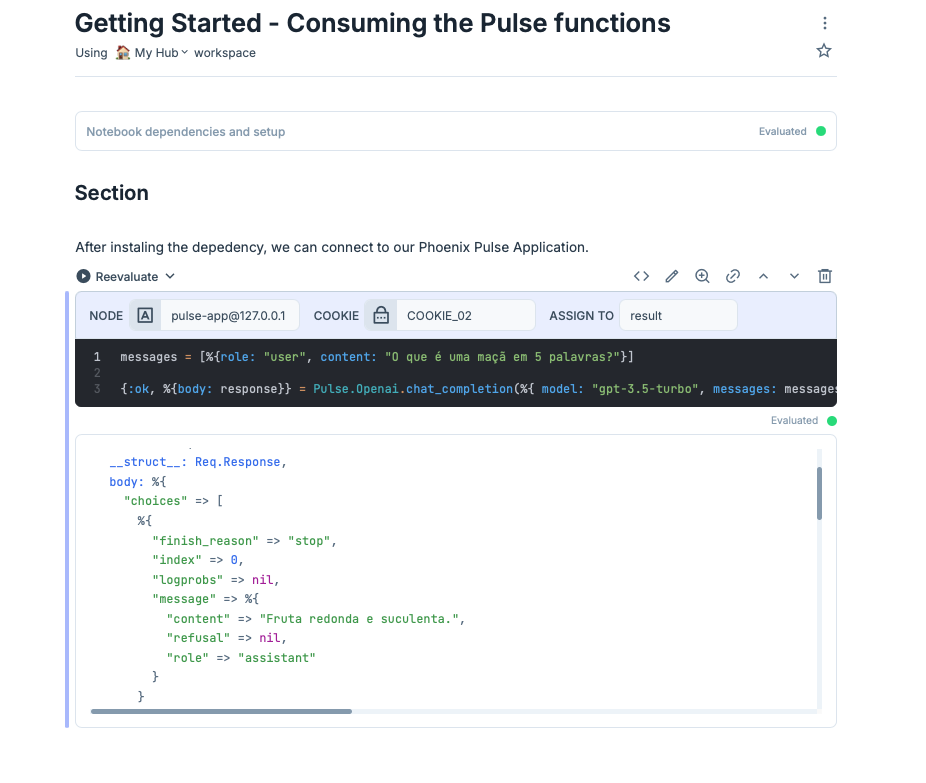
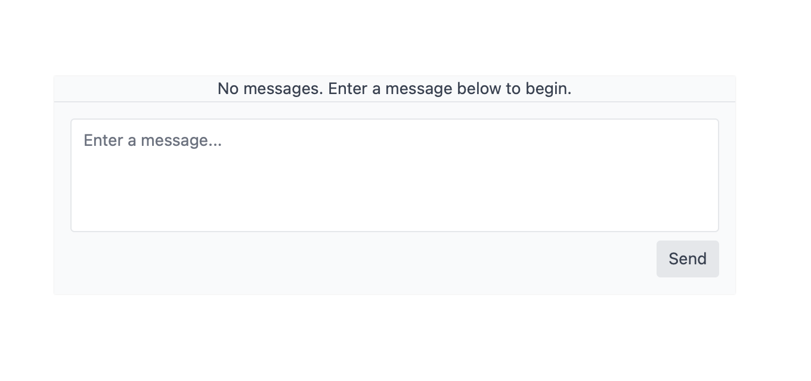
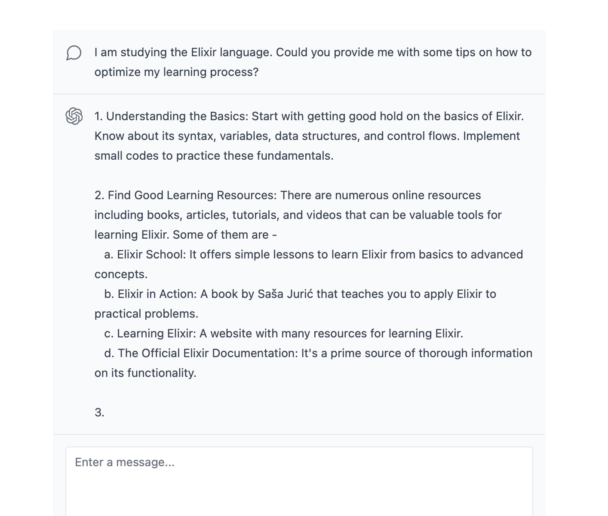

# Pulse

Application created while I was learning how to Streaming OpenAI in Elixir and Phoenix.


## Learn more
I walked through this tutorial's series by [Ben Reinhart](https://github.com/benjreinhart) following each step to build this project.

Here is the sequence of tutorials:

- [Part 01](https://benreinhart.com/blog/openai-streaming-elixir-phoenix/)
- [Part 02](https://benreinhart.com/blog/openai-streaming-elixir-phoenix-part-2/)
- [Part 03](https://benreinhart.com/blog/openai-streaming-elixir-phoenix-part-3/)

In order to develop this project, you will need to create an OpenAI account and obtain your API key.

I'm storing my API key in a `.env` file in the root of the project. You can create your own `.env` file and add the following content:

```bash
OPENAI_API_KEY="your-openai-key"
```

Add the following dependencies to your `mix.exs` file:

```elixir
{:dotenv_parser, "~> 2.0"},
```

And these instructions to your `runtime.exs`:

```elixir
if config_env() == :dev do
  DotenvParser.load_file(".env")
end
```

```elixir
config :pulse, :openai, api_key: System.fetch_env!("OPENAI_API_KEY")
```


### Setting up the project
To start this Phoenix server:

  * Run `mix setup` to install and setup dependencies
  * Start Phoenix endpoint with `mix phx.server` or inside IEx with `iex -S mix phx.server`

Now you can visit [`localhost:4000`](http://localhost:4000) from your browser.

### Working with data

During the developemnt, you can use the instructions below to interact wit the `chat_completion` function.

```
{:ok, %{body: response}} = Pulse.Openai.chat_completion(%{ model: "gpt-3.5-turbo", messages: [%{role: "user", content: "Hello 3.5!"}] })
```

```
{:ok, %{body: response}} =

Pulse.Openai.chat_completion(
  %{
    model: "gpt-3.5-turbo",
    messages: [%{role: "user", content: "Hello 3.5!"}]
  },
  &IO.puts/1
)
```

#### Playing with the `chat_completion/1` function.

Open your `iex` terminal.


Define the `messages` variable:

```elixir
messages = [%{role: "user", content: "O que é uma maçã em 5 palavras?"}]
```

Passing the messages variable to the function calling:

```elixir
{:ok, %{body: response}} = Pulse.Openai.chat_completion(%{ model: "gpt-3.5-turbo", messages: messages })
```

You can add more parameters as max_tokens, temperature, etc.

```elixir
{:ok, %{body: response}} = Pulse.Openai.chat_completion(%{ model: "gpt-3.5-turbo", max_tokens: 1000, temperature: 0, messages: messages })
```

Here is a simple way you can obtain the response `content` utilizing the `Map` functions:

```elixir
content = response |> Map.get("choices") |> Enum.at(0) |> Map.get("message") |> Map.get("content")
```

And there's a better way to perform it, utilizing the pattern matching.

To obtain the `finish_reason`:

```elixir
%{"choices" => [%{"finish_reason" => finish_reason}]} = response
```

Type `finish_reason` and you will see the value "stop".

And to obtian the message `content`:

```elixir
%{"choices" => [%{"message" => %{ "content" => content }}]} = response
```

Type `content` and you will see the value "Fruta redonda e saborosa.".

As you can see, pattern matching is a powerful tool in Elixir for parsing nested data structures. So, you can use it to extract the data you need. Get used to it.

### Organizing the sequence of conversarion

1. Define the messages Map

```elixir
messages = [%{role: "user", content: "O que é uma maçã em até 5 palavras?"}]
```

2. Call the prompt with our initial messages Map

```elixir
{:ok, %{body: response}} = Pulse.Openai.chat_completion(%{ model: "gpt-3.5-turbo", max_tokens: 1000, temperature: 0, messages: messages })
```

It will generate our response. Note the message Map returned:

```json
"message" => %{
        "content" => "Fruta redonda e saborosa.",
        "refusal" => nil,
        "role" => "assistant"
      }
```

3. Pattern matching the response to obtain the message node.

```elixir
%{"choices" => [%{"message" => message}]} = response
```


4. Add the message to the messages Map.

```elixir
messages = messages ++ [message]
```

This will be the result of the new messages Map

```json
[
  %{role: "user", content: "O que é uma maçã em até 5 palavras?"},
  %{
    "content" => "Fruta redonda e saborosa.",
    "refusal" => nil,
    "role" => "assistant"
  }
]
```


5. Add the map for the next question to the messages Map.

```elixir
messages = messages ++ [%{role: "user", content: "E qual a sua cor?"}]
```

The new result of messages Map:

```json
[
  %{role: "user", content: "O que é uma maçã em até 5 palavras?"},
  %{
    "content" => "Fruta redonda e saborosa.",
    "refusal" => nil,
    "role" => "assistant"
  },
  %{role: "user", content: "E qual a sua cor?"}
]
```

And process the prompt again, now with the messages Map containing the first and the last message.
Processa novamente o prompt.

```elixir
{:ok, %{body: response}} = Pulse.Openai.chat_completion(%{ model: "gpt-3.5-turbo", max_tokens: 1000, temperature: 0, messages: messages })
```

Note the new content returned on the message Map.

```json
"message" => %{
           "content" => "Vermelha ou verde.",
           "refusal" => nil,
           "role" => "assistant"
         }
```

### Livebook

For an interactive example, you can utilize the [Livebook Getting Started - Consuming the Pulse functions](notebooks/getting_started.livemd). More instructions will be provided soon.





### The final project. How it looks like

The chat is available on chats router. You can visit [`localhost:4000/chats`](http://localhost:4000/chats) from your browser.

The text form to with your questions.



The response streaming from OpenAI.



## Dependecies

This project relies on these dependencies:

* Req ([link](https://hexdocs.pm/req/readme.html)), for HTTP requests
* DotenvParser ([link](https://hexdocs.pm/dotenv_parser/DotenvParser.html)), for parsing `.env` files

### Dealing with building artifacts problems

Sometimes there's some incompatibilies with the files on `_build` folder. In this case, proceed with one of the steps below.

Clear and recompile modules with:

```bash
mix compile --force
```

Clear build artifacts and compile:

```bash
rm -rf _build
mix deps.compile
mix compile
```
